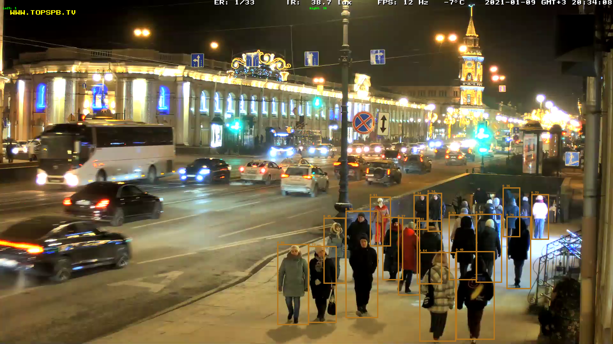

# Count people on Saint-Petersburg street cameras

The project uses COCO-pretrained YOLOv5 (https://github.com/ultralytics/yolov5) to detect and count people on live stream videos.

Sample results:



## Installation

```
git clone git@github.com:Miffka/count_people.git
cd count_people
pip install -r requirements.txt
```

## Usage

Several web-cameras are available:

```python
VIDEO_ULRLS = {
    "gostiny": {"url": "https://youtu.be/wCcMcaiRbhM", "use_pafy": True},
    "anichkov": {"url": "https://youtu.be/jbqT0fTj088", "use_pafy": True},
    "slavy": {"url": "http://93.100.5.209:8093/mjpg/video.mjpg", "use_pafy": False},
}
```

### Draw bounding boxes on detections

To check the quality of detection replace `{source_name}` with `gostiny`, `anichkov` or `slavy` in the command

```
python person_count/draw_people.py --source_name {source_name}
```

### Collect data

To run script in data-collecting mode run

```
python person_count/count_people.py
```

(c) Miffka